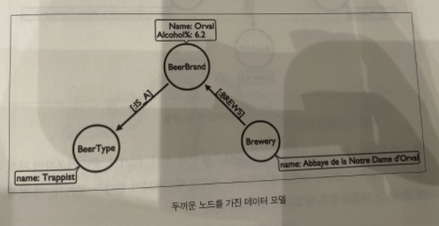

## Neo4j
> 정의
- 오픈소스 그래프 DB, 그래프 DB 분야에서 1위
- 특정한 작업 부하에 최적화된 순수한 그래프 지향적인 스토리지 형식의 DB

> 배경
- 원래 RDBMS 기반의 단순 그래프 라이브러리였으나 기반에서부터 그래프 저장소를 만드는 그래프 특화 DB로 변신
    → 전체 인프라가 그래프 데이터로 처리하도록 최적화돼 있음
    
> 특징
- ACID 트랜잭션 호환(지원)
- Native 그래프 DB로서, 그래프 엔진 레벨을 넘어서 스토리지 레벨까지 구현
- 그래프 전용 쿼리 언어 Cypher 제공

## 쿼리언어 Cypher
- SQL-Like **선언형** 쿼리 언어
- 그래프 모델에 특화됨

## 트랜잭션
**DB의 상태를 변화시키기 위해 수행하는 작업의 단위**
- CRUD 등의 질의어를 이용하여 DB에 접근
- 작업 단위는 많은 질의어 명령문들을 사람이 정하는 기준에 따라 정하는 것을 의미

> ACID
1. **원자성(Atomicity)**
    - 전부 또는 무의 규칙
    - 트랜잭션의 일부가 실패한 경우, 전체 트랜잭션이 롤백되어야 함 = 원자화
    - 트랜잭션이 DB에 모두 반영되던가, 아니면 전혀 반영되지 않음

2. **일관성(Consistency)**
    - 일관성 있고 유효한 데이터만 DB에 입력될 수 있음    
    1) **RDBMS에서의 의미** : DB의 스키마를 항상 적용하고 유지 관리할 것
    2) **Neo4j에서의 의미** : 그래프 관계에 시작과 종료에 노드가 존재할 것
    그리고 관계가 일시적으로 중단되어서는 안 됨
    
3. **독립성(Isolation)**
    - 둘 이상의 트랜잭션이 실행되고 있을 경우 어떤 하나의 트랜잭션이라도, 다른 트랜잭션의 연산에 끼어들 수 없음

4. **지속성(Durability)**
    - 트랜잭션이 성공적으로 완료되었을 경우, 결과는 손실 없이 영구적으로 반영되어야 함

> 연산
- **Commit** : 하나의 트랜잭션이 성공적으로 끝났다는 것을 알려주는 연산
- **Rollback** : 하나의 트랜잭션 처리가 비정상적으로 종료되어 트랜잭션의 원자성이 깨진 경우, 트랜잭션을 처음부터 다시 시작하거나 트랜잭션의 부분적으로만 연산된 결과를 취소시킴

## 다운로드
- 초기 username / password : **neo4j / neo4**

### 1. 패키지 구성
1. **커뮤니티 에디션** : 기본값
2. **엔터프라이즈 에디션** : 클러스터링 (고가용성 및 로드 밸런싱), 고급 모니터링, 고급 캐싱, 온라인 백업 등 여러 엔터프라이즈 기능 제공

### 2. 다운로드 종류
1. **샌드박스** : 웹 사이트에서 임시로 일주일 간 사용가능한 서버 제공
2. **데스크탑 = GUI** : 툴 앱을 로컬에 직접 설치
    - 웹UI와 동일
    - 도커로 띄운 Neo4j를 인식하지 않는 단점이 있음
        
3. **도커 컨테이너 활용** : 
    도커는 가상 머신에 부담을 주지 않고 시스템의 이미지를 실행할 수 있게 해주는 가상화 기술
    이 기술을 사용하면 애플리케이션의 지속적인 배포(CD)와 Devops 등을 가능하게 함
    
    1. 이미지 다운로드        
        ```
        docker pull neo4j
        ```
        
    2. 이미지 실행
        ```
        docker run --publish=7474:7474 --publish=7687:7687 --volume=$HOME/neo4j/data:/data neo4j
        ```
        
## 개념
> 포트
- http : 7474
- https : 7473
- bolt : 7687

### 1. 명령어
다운로드
```bash
brew install neo4j
```

기본
```bash
neo4j { console | start | stop | restart | status | version }
```

curl로 호출
```bash
curl -v -u neo4j : neo4j -X POST localhost : 7474 / user / neo4j / password -H "Content-type : application / json"-d "{\"password \ ": \"newpassword \ "}"
```

## 모델링 예시
- 질의 패턴에 따라 달라짐
1. **설계를 어떻게 하느냐에 따라 노드의 구성을 다르게 할 수 있음**
    1) 알코올 비율을 측정하지 않을 때
    
    
    2) 알코올 비율을 측정할 때
    
    
    
2. **그래프 색인 기능 (인덱스) 활용 : 트리 구조**
    
    
    
3. **안티패턴**
    - 하나의 노드가 너무 많은 속성을 가지고 있을 때
    - 노드의 개념이 제대로 분리되지 않았을 때
    - 연결되지 않은 그래프
4. **고밀집 노드문제**
    - 데이터 집합의 엔티티가 다른 엔티티와 많은 관계를 가진 경우에 발생
    - 데이터에 팬-아웃 패턴을 적용하는 것과 같은 예방 조치를 취할 수 있음