# 개요

- 네이버, 아마존을 거쳐 마이크로소프트 개발자로 근무하고 계시는 백기선님의 스프링 REST API 인프런 강좌
- REST 규칙을 준수하는 RESTFul한 API를 작성하는법을 중심으로, TDD, 간단한 스프링 시큐리티에 대한 내용을 다룬다.
- https://www.inflearn.com/course/spring_rest-api

# 그런 REST API로 괜찮은가?

https://www.youtube.com/watch?v=RP_f5dMoHFc&t=153s

- 2017년 네이버 D2 개발자 컨퍼런스에서 진행된 발표로, 대부분의 REST API를 주장하는 API들이 사실은 REST 규칙을 지키고 있지 않은 RESTful하지 않은 API라는것을 지적하고, RESTful한 API는 어떻게 작성해야 되는지를 이야기 한다.

# 지켜지지 않는 REST 스타일 아키텍처 요소

- REST는 분산 하이퍼미디어 시스템(e.g. 웹)을 위한 아키텍처 스타일이다.
- 아키텍처 스타일은 제약조건의 집합이다.
- REST를 구성하는 6가지 스타일
    - Client-Server
    - Stateless
    - Cache
    - `Uniform interface`
    - Layered System
    - Code on demand (Optional) : 서버에서 클라이언트 사이드로 코드를 보내 실행할 수 있는지(=자바스크립트)
    
> 이 6가지 중 5가지는 HTTP만 따라도 잘 지킬수 있고 지켜지고 있다. 그러나 이 중 Uniform interface가 지켜지지 않는다고 지적하고 있다. 
    
# Uniform interface

Uniform interface라는 아키텍처 스타일은 4가지 제약조건을 지닌다

- Identification of resources : 리소스가 URI로 식별이 되어야 한다.
- Manipulation of resources through representations : Representation 전송을 통해 리소스를 조작할 수 있어야 한다.(HTTP 메시지에 표현을 담아 전송하므로 등록, 수정, 삭제 등을 가능케 하는 것)
- `Self-descriptive messages` 
- `Hypermedia as the engine of application state` (HATEOAS)

> 이 중 세번째와 네번째에 대해 대부분의 API들이 지키지 못하고 있다고 이야기 한다.

## Self-descriptive messages

> 메시지는 스스로를 설명할 수 있어야 한다

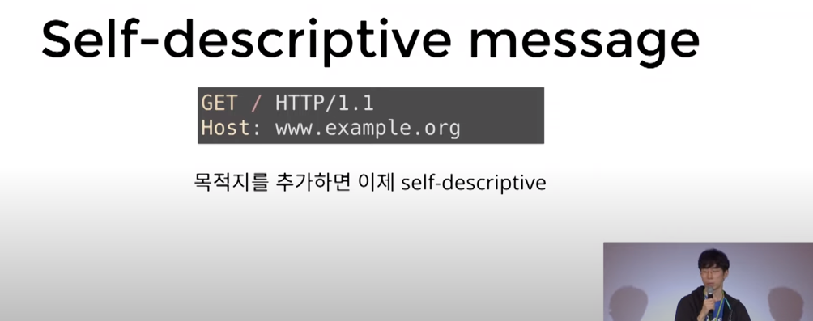

- 목적지에 대한 설명이 존재

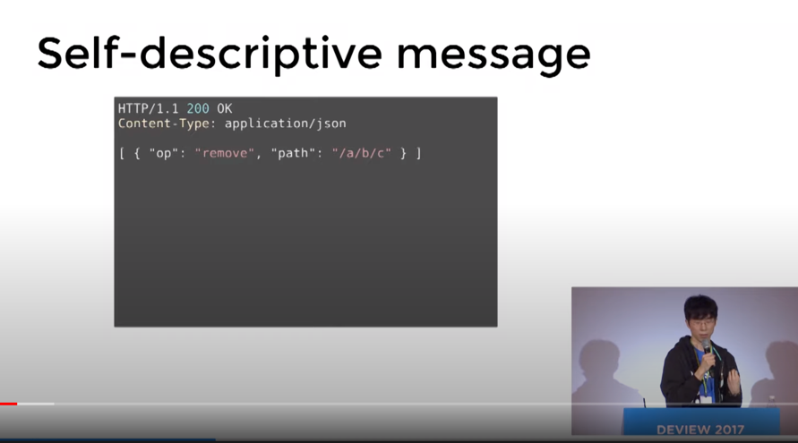

- 응답이 어떤 문법으로 작성되었는지에 대한 설명이 존재

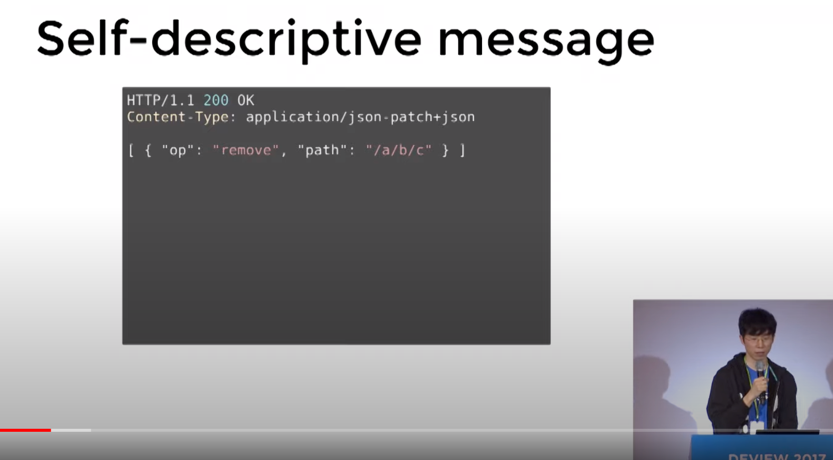

- 응답의 문법과 변수의 뜻을 유추할 수 있는 명세까지 존재

> 응답 하나만으로 응답의 모든 내용을 유추 할 수 있도록 해주어야 한다는것을 의미하며, 이는 서버가 변하여 메시지가 변해도 여전히 클라이언트가 메시지를 읽고 변화에 대응할 수 있도록 해야 한다.

## HATEOAS

> 어플리케이션의 상태가 하이퍼링크를 통해 전이될 수 있어야 한다
> 하이퍼링크를 통해 어플리케이션의 상태 변화가 가능해야 한다

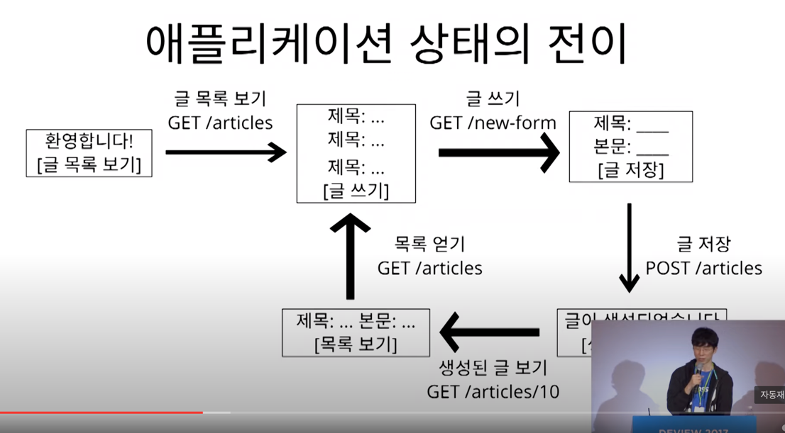

- 글 목록이 나오고 -> 글쓰기 버튼이 나오고 -> 작성폼이 나오고 -> 저장버튼을 누르고 -> 목록으로 돌아가지고
- 이렇게 링크를 타고 계속해서 전이가 되는것도 하이퍼링크를 통한 전이, HATEOAS가 된다

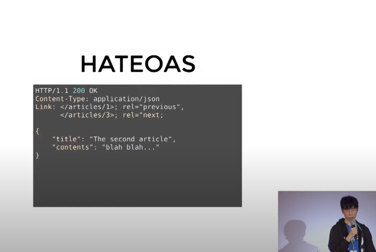

- 특정글 상세조회시, 이전글과 다음글에 대한 링크와 정보를 제공함으로써 사용자는 링크를 스스로 파악하여 행동을 취할 수 있다.

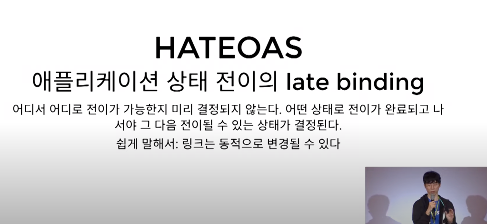

- "서버가 링크를 바꾸더라도 클라이언트의 동작에는 문제가 없다. 바뀐 링크를 따라가면 된다"

> REST API에서의 HATEOAS는 링크의 Late binding, 링크를 마음대로 동적으로 변경함으로써 API의 Versioning에 대한 걱정을 줄이는것을 목표로 한다.

## 독립적 진화

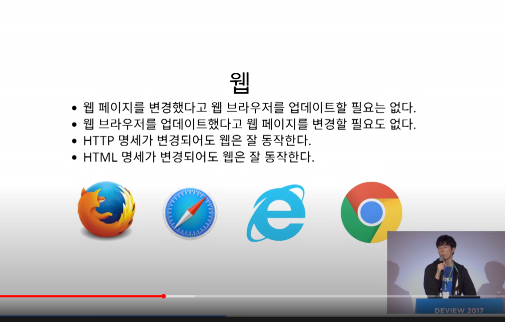

- 이를 준수함으로써 추구하는 궁극적인 목적은 서버가 바뀌던 클라이언트가 바뀌던 영향을 미치지 않고, 각각 독립적으로 진화할 수 있도록 하는것이다.

# 문제 해결 방안 제시

## Self-descriptive messages 해결 방안

- Link 헤더에 Profile Relation으로 문서 링크를 제공한다.

## HATEOAS 해결 방안

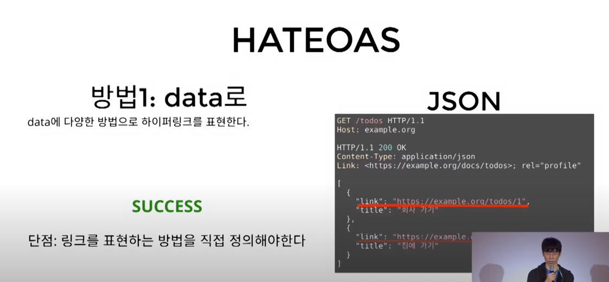

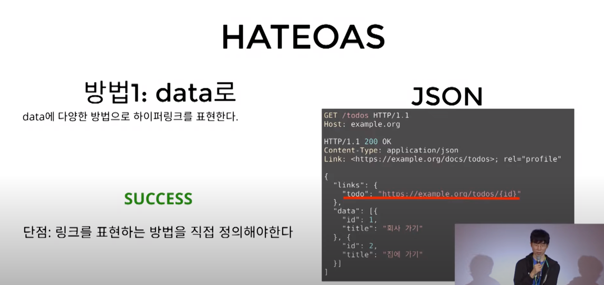

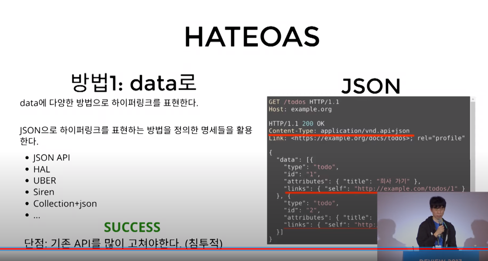

- 데이터에 링크 담기

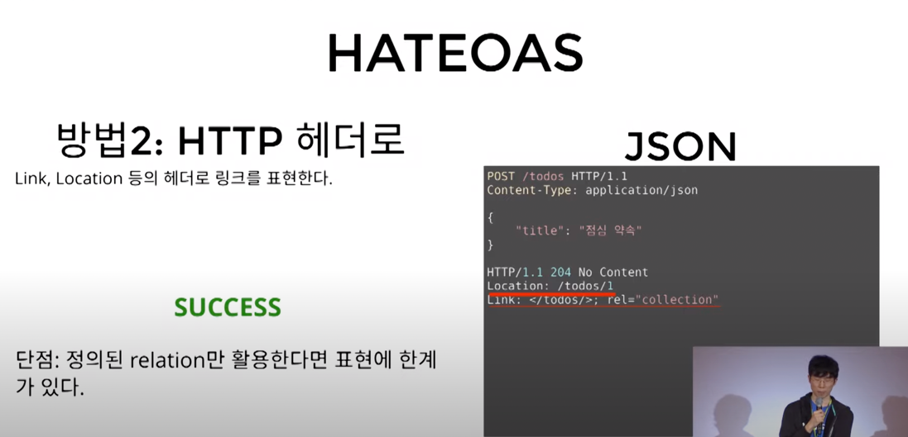

- 링크 헤더에 링크 담기

# 정리

